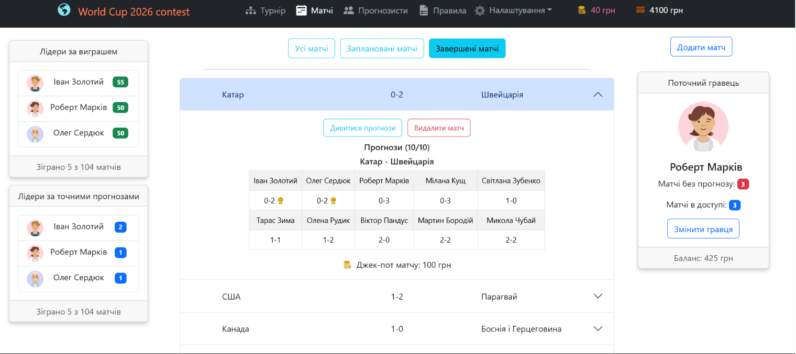

# 🏆 Football Prediction Contest App

A web application designed to automate charity prediction contests during major football tournaments. This project replaces manual tracking with a transparent, automated system where every correct prediction contributes to charity goals.

**🔗 [Live Demo (GitHub Pages)](https://olehkuts.github.io/prediction_contest/)**

---

### 🚀 Key Features

- **Dynamic Tournament Grid:** Automatic calculation of standings in groups and play-off brackets.
- **Jackpot System:** Cumulative prize pool model. If no one guesses the exact score of a match, the fund rolls over to the next game.
- **Leaderboards:** Two main categories — most accurate predictions and highest total winnings.
- **Flexible Settings:** Capability to edit contest rules, titles, and entry fees for different tournament stages.
- **Persistent Data:** Full synchronization with `LocalStorage` ensures all player and match data is saved even after a page refresh.
- **PDF Generation:** Export backup data`.

### 🛠 Tech Stack

- **Frontend:** React (v18), React Router v7.
- **State Management:** Redux Toolkit.
- **UI Components:** React Bootstrap, Bootstrap Icons.
- **Forms & Validation:** Formik + Yup.
- **Graphics:** Dicebear API (avatars), Flag Icons (national team flags).
- **Data Persistence:** Custom implementation of Redux state persistence in `LocalStorage`.

### 📸 Application Interface



_Tournament results visualization and automatic group updates._

---

### 🏗 Data Architecture (Redux Toolkit)

The application state is organized into logical modules using the following slices:

- **`playerSlice`**: Manages player profiles, deposits, and individual statistics.
- **`gameSlice`**: Handles match results, prediction logs, and jackpot distribution logic.
- **`teamSlice`**: Manages national team data and their tournament progression.
- **`filterSlice`**: Global state for filtering matches by status and schedule.

---

### ⚙️ Installation & Setup

1. Clone the repository:
   ```bash
   git clone https://github.com
   ```
2. Install dependencies:
   ```bash
   npm install
   ```
3. Run the project in development mode:
   ```bash
   npm start
   ```
